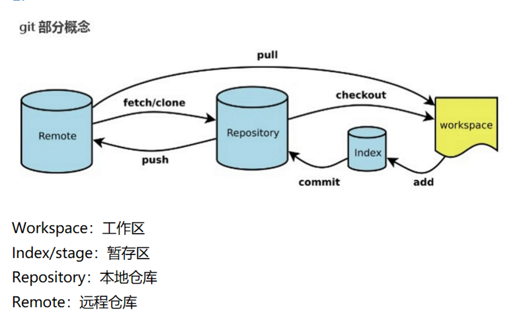

# 数据库

## MySQL

innodb原理

>   基于磁盘存储，由于cpu和磁盘速度之间有鸿沟，所以会采用缓冲池技术来提高数据库的整体性能。首先将读的页放入缓冲池，修改就先修改到缓冲池中，再以一定的频率刷回磁盘


varchar和char的区别？

>   varchar可变，char不可变
>
>   char比varchar效率高
>
>   char对英文是一个字节，汉字两个字节；varchar都是两个字节


自增主键，删除id=10的数据，下一个数据id是？

>   11


慢查询的检查

>   慢查询是超过默认查询时间（10s）
>
>   判断是否是无效引导列，或者没有引导列，需要对语句进行重写
>
>   >   比如是否可以排序之类
>
>   判断是否用了索引，或者索引失效；
>
>   >   运行语句，找到慢查询的sql
>   >
>   >   查看explain执行计划：id, possible_keys,key,key_len,rows,extra
>
>   判断是否确实是是数据过大
>
>   >   分库分表：
>   >
>   >   读写分离：主写，从读
>   >
>   >   垂直分区：简化表结构，但会出现冗余，引发join，使事务复杂
>   >
>   >   水平分区：支持大数据量存储，但对于分片事务难以处理


时间类型的选择

>   不要使用字符串：效率低，占时间
>
>   首选timestamp（时区），其次是datetime，int（其实也挺好，查询快）


子查询和连接查询

>   子查询：嵌套，不容易死锁，可能会多次遍历数据。适合小数据量
>
>   连接查询：连表，仅遍历一次。


删除

>   - 用法区别
>
>       - drop会删除表结构
>       - delete会删除表数据，不加where和truncate差不多。
>       - truncate清空数据，再插入数据的时候自增长 id 又从 1 开始（重置），在清空表中数据的时候使用（说白了就是删除表再创建）
>
>   - 属于不同的数据库语言
>
>       - drop和truncate属于DDL(数据定义)，立即生效不能回滚。DDL 语句更多的被数据库管理员（DBA）所使用。
>       - delete属于DML(数据操作)，可以回滚。不涉及到表的定义、结构的修改，更不会涉及到其他对象。
>
>   - 执行速度
>
>       drop > truncate > delete
>
>       因为Delete需要生成日志
>
>       truncate需要重置


inner join （默认）：AB交集

left join,right join：A全集+B非空；B全集+A非空

full join：AB并集


sql执行顺序

>   from, join, where, group by, having, select, order by, limit


临时表

>   group by 和 distinct ,union的extra字段是using temporary，用于辅助sql执行
>
>   临时表其他事务查不到，主要用于排序和分组
>
>   索引可以避免排序分组，则避免创建临时表，加速查询


外键

>   优点：两边之间的关系
>
>   缺点：需要维护；不易于业务逻辑的变更；对分库分表不友好


模糊查询

>   左值不定，不要使用索引


优化

>   不在数据库中存储图片，文件，只存储它们的地址
>
>   限制单表的索引数量
>
>   自增主键，使用业务主键
>
>   锁的粒度尽可能小
>
>   读写分离


主键为什么建议自增

>   避免在插入数据时进行排序，底层是b+树，需要有序，无序需要花时间排序
>
>   主键自增，对二级索引友好，便于二级索引找到主键索引编号，从而快速找到记录，检索数据
>
>   主键自增，在order by g避免创建临时表


年龄的类型设置

>   可以采用timestamp设置生日，避免要改表


select for update 是加表锁还是行锁

>   如果查询条件用了索引/主键，就是行级
>
>   否则为表级


**具体说下RR和RC？哪个效率高？**

>   1）RC隔离级别时，事务中的每一条select语句会读取到他自己执行时已经提交了的记录，也就是**每一条select都有自己的一致性读ReadView**;
>   2）而RR隔离级别时，事务中的一致性读的ReadView是以**第一条select语句**的运行时，作为本事务的一致性读snapshot的建立时间点的。只能读取该时间点之前已经提交的数据。(也就是事务开始)
>
>   RC的效率高，因为RC没有gap 锁，也允许幻读和不可重复读的情况出现，并发就会好，RR要利用Gap控制幻读，当一个事务在操作时，其他事务就会被阻塞，并发差。


## Redis

定义

>   Redis 就是一个使用 C 语言开发的数据库, 是key-value存储系统，数据存储在内存中。可存储类型有string, list , set, zset(sorted set), hash


数据类型

>   string：最基本的数据类型，二进制安全的字符串，最大512M。
>
>   hash：key-value对的一种集合。
>
>   list：按照添加顺序保持顺序的字符串列表。
>
>   set：无序的字符串集合，不存在重复的元素。
>
>   sorted set：已排序的字符串集合。


数据过期删除策略

>   定期删除：对内存友好，cpu不友好
>
>   惰性删除：对CPU友好，对内存不友好


数据持久化策略

>   AOF：追加。逐条执行命令（AOF重写）
>
>   RDB：替换文件。在特定时间保存一个时间点的数据快照
>
>   混合：替换，然后新增加的部分采用追加


多路复用

哨兵、主从、集群资源


redis单线程

>   用户请求，到处理请求，返回请求时单线程，写AOF日志也是用主线程
>
>   但是redis从AOF写入磁盘是多线程，删大数据是多线程，


redis优点

>   速度快：键值对的方式；基于内存；单线程模型避免了不必要的上下文切换及竞争条件
>
>   有丰富的数据类型
>
>   具备原子性
>
>   持久化存储，有一定的数据容灾能力，因为会利用rdb和aof做数据的持久化


redis缺点

>   redis是内存数据库，短时间内大量增加数据，可能会导致内存不够用。如果内存增长过快，需要定期删除数据
>
>   redis是单线程的，单台服务器无法充分利用多核服务器的CPU
>
>   需要考虑缓存和数据双写一致性的问题：延迟双删策略，因为修改了数据库数据，就需要删除缓存，那么什么时候删除缓存是合适的。
>
>   缓存雪崩、缓存击穿、缓存穿透的问题


使用场景

>   缓存：频繁被访问的数据，减少数据库压力，也加速（string）
>
>   实时性高，抢购，排行榜：存取速度要求高(sort set)
>
>   计数器：incr命令，通过内存操作性能高，允许有一定的延迟，之后再刷入数据库
>
>   限流：限制某些操作、接口执行访问速率。
>
>   还支持分布式锁，但是我对这部分不是很了解。
>
>   
>
>   string：简单类型，set，get操作，做简单的kv缓存
>
>   hash：可以将结构化的数据进行缓存，可以再每次读写缓存的时候，操作hash里的某个字段
>
>   list：有序列表，存储一些列表的数据结构，类似粉丝列表，文章评论列表，分页查询（高性能分页），简单的消息队列（从 list 头怼进去，从 list 尾巴那里弄出来）。
>
>   set：无序集合，自动去重。看看共同好友。（考虑全局的多态机器不能再hashset上进行去重）
>
>   sorted set：排序的set，去重还可以排序，可以做热榜。


redis为什么比mysql快

>   kv方式，mysql是b+树
>
>   在内存中，存取速度快，mysql要持久化到磁盘
>
>   redis单线程多路复用，避免线程切换，多路复用避免io等待


缓存击穿：访问一个键，刚好缓存过期，大量对这个键的访问造成了数据库压力

>   加锁、对热点设置永远不过期

缓存穿透：大量请求查询不存在的key，对数据库造成压力

>   布隆过滤器：对一定不存在的key进行过滤
>
>   对空结果也进行缓存

缓存雪崩：在同一个时间段，大量的键过期，造成了数据库的压力

>   加锁、错峰、队列、二级缓存


与memcached区别

>   redis支持持久化数据
>
>   redis有灾难恢复机制


**签到**（bitmap：海量数据大大减少内存占用）

>   对于二值状态场景，我们就可以利用 Bitmap 来实现。比如登陆状态我们用一个 bit 位表示，一亿个用户也只占用 一亿 个 bit 位内存 ≈ （100000000 / 8/ 1024/1024）12 MB。
>
>   **判断是否在线**
>
>   <k,v> = <login_status, value>，offset是value的偏移量，这个关系是隐藏的
>
>   key ：login_status 表示存储用户登陆状态集合数据， 
>
>   offset：将用户 ID 作为 offset，
>
>   每一位：在线就设置为 1，下线设置 0。
>
>   通过 `GETBIT`判断对应的用户是否在线。 50000 万 用户只需要 6 MB 的空间。
>
>   **统计用户每个月签到情况**
>
>   <k,v> = <uid:sign:{userId}:{yyyyMM}, value>
>
>   key ：设计成 `uid:sign:{userId}:{yyyyMM}`，【键可以设置为联合的】
>
>   offset：月份的每一天的值 - 1
>
>   每一位：0,1是否签到
>
>   ```sql
>   -- 判断编号 89757 用户在 2021 年 5 月 16 号是否打卡
>   GETBIT uid:sign:89757:202105 15
>   -- GETBIT <key> <offset>
>   ```
>
>   **连续签到用户总数**
>
>   <k,v> = <day, value>
>
>   key：每天日期
>
>   offset ：userid
>
>   value: 是否签到
>
>   统计的话，可以对应bitmap按位做与运算

list可用于评论列表，粉丝列表，zset也可以，灵活，但是占用内存大


redis命令，基本string

>   set key value添加
>
>   get key 获取
>
>   exists key 判断key是否存在
>
>   del key 删除
>
>   expire key seconds 设置过期时间
>
>   flushdb 清空当前数据库
>
>   flushall 清空所有数据库的内容
>
>   append key value 追加


# 计网

接收方收到废报文

>   丢弃，但会发送ACK

确认迟到

>   丢弃

确认丢失

>   超时重传


为什么ack  = x+1

>   表示接收方下次想要接受的报文的序列是x+1
>
>   保证了数据的有序接受


为什么三次握手第二次要发送syn

>   因为ack不带数据就不消耗序列号，为了让请求方知道它的起始序号，发送syn
>
>   另外syn不可携带携带数据，ack带数据才消耗序列号


为什么三次握手

>   确保收发双发的起始序列号
>
>   确保收发双方的接受和发送能力都正常
>
>   防止超时的请求占用资源


为什么挥手要四次

>   因为fin和ack是分开发送的
>
>   客户端发起fin请求只是说明客户端没有数据要传输了 ，但不意味着服务器没有数据要传输了，所以fin表示回应，然后发送未发完的数据，然后再发ack


为什么要等2MSL

>   因为以防最后一次确认丢失，在2msl的时候还能再重传
>
>   清理过期的请求，保证不会带到下一个请求中


半连接状态

>   没有完成三次握手，会进入半连接队列，完成后移除，并进入全连接队列
>
>   如果全连接满了可能会发生丢包
>
>   SYN有重传次数限制还有时间（指数增长）
>
>   存在SYN攻击，伪造ip发送了但不回应，就会导致请求进入半连接队列，占满，无法正常工作。可以通过改变半连接队列的大小、超时时间、丢弃


TCP的拆包和粘包

>   原因:
>
>   TCP面向字节流、没有消息保护。
>
>   要发送数据大于MSS,大于发送缓冲区剩余空间大小，拆包；
>
>   小于就粘包
>
>   解决：
>
>   在TCP首部存入数据包长度
>
>   每个包末尾使用固定分隔符
>
>   固定长度，浪费资源


post和get区别

>   post是提交数据传输实体主题，get是请求资源
>
>   post是在请求正文中，所以支持标准字符集；get值支持ascii，因为url只支持ascii
>
>   post不安全，不幂等；get安全，幂等
>
>   post可以不可以缓存，get可以缓存


url和uri

>   url:统一资源定位符
>
>   uri:统一资源标志符


分布式系统中的负载均衡算法

>   轮询
>
>   随机
>
>   哈希：缓存亲和力


RPC

>   像调用本地方法一样调用远程方法
>
>   客户端发起请求
>
>   客户端代理将请求参数序列化，发给服务器代理
>
>   服务器代理将请求反序列化，调用本地服务
>
>   服务器执行业务逻辑，返回处理结果，将结果序列化，返回给服务器代理...


请求转发(forward)和重定向(Redirect)

>   请求转发：
>
>   url不变；客户端只做一次请求，服务器内部转发资源，客户端感觉不到被转发了；由于是一个request域，可共享资源
>
>   重定向：
>
>   url变；服务器告诉客户端你去这里找资源，所以客户端发起两次请求；不共享资源，可定向到任意资源


http状态码

>   2xx：状态好
>
>   ```java
>   200: OK;
>   206:请求部分资源OK
>   ```
>
>   3xx：重定向
>
>   ```java
>   301:永久转移;
>   302:临时转移;
>   ```
>
>   4xx：客户端
>
>   ```java
>   400:语法错误;
>   403:服务器拒绝服务
>   404:找不到资源
>   410:资源被永久删除
>   ```
>
>   5xx：服务器（500）不可预期错误
>
>   502:错误网关，连接超时，服务器连接过多，导致服务器无法给正常的响应
>
>   503：不处理客户端请求，在一段时间可能恢复正常


https实现原理

[参考](https://segmentfault.com/a/1190000021559557)

HTTPS 是会对 HTTP Header + HTTP Body 整个加密的，所以 URL 自然是会被加密的。

**目标：**

-   商定双方通信所使用的的 **TLS 版本** (例如 TLS1.0, 1.2, 1.3等等)；

-   确定双方所要使用的**密码组合**；

-   客户端通过服务器的公钥和数字证书

-   生成会话密钥，该密钥将用于握手结束后的对称加密。


**过程：**

第一步：tcp三次握手

第二步：tls请求。客户端发送client_hello（密码信息+客户端随机数）

>   包含**tls版本**+**客户端随机数**+**加密**套件候选列表+**压缩**算法候选列表

第三步：服务端发送serve_hello（选择密码组合+数字证书+服务器随机数）

>   选择使用的TLS协议版本 + 选择**加密**套件+选择**压缩**算法 + **服务器随机数**+数字证书

>   发送证书的过程可能涉及分段！
>
>   MTU:最大传输单元，【分片，数据链路层限制】，至少需要在ip分
>
>   MSS:TCP交给IP最大分段大小，【分段，ip层限制】

第四步：客户端验证数字证书，验证通过生成**随机字符串**（pre_secret），并用服务器公钥加密

>   验证：
>
>   利用CA的公钥对数字签名进行解密，得到信息摘要
>
>   将证书的内容（服务器的公钥）利用散列函数得到信息摘要，
>
>   看两者是否一致

第五步：将被公钥加密的随机字符串给服务器

第六步：服务器使用自己的私钥解密获取随机字符串

第七步：客户端和服务器双方使用相同的算法，使用客户端随机数+服务器随机数+随机字符串生成相同的用于对称加密的key

>   注意：此处不对秘钥进行传递，而只是使用相同的规则

第八步：客户端发送finished

第九步：服务器发送finished

成功建立安全链接，双方使用共同的key 进行http通信


**https加密常用算法？**

>   非对称加密算法：RSA，加密速度慢
>
>   对称加密：DES AES，
>
>   hash算法：但hash不可逆，SHA，MD5


**socket。并简述基于tcp协议的套接字通信流程**

socket是系统提供用于网络通信的方法

步骤：

创建一个socket socket()

设置socket属性，setsockopt

绑定ip地址，端口到socket bind

设置要连接的对方的ip和端口

连接 connect()

收发数据，send recv/ read write

关闭网络连接


**ipv4和ipv6区别**

>   **1、协议地址的区别**
>
>   1）地址**长度**
>
>   IPv4协议具有32位（4字节）地址长度；IPv6协议具有128位（16字节）地址长度
>
>   2）地址的**表示方法**
>
>   IPv4地址是以小数表示的二进制数（点分）。IPv6地址是以十六进制表示的二进制数。（冒号分）
>
>   3）**地址配置**
>
>   IPv4协议的地址可以通过**手动或DHCP**配置的。
>
>   IPv6支持无状态地址自动配置和状态地址自动配置两种地址自动配置方式
>
>   **2、数据包的区别**
>
>   1）包的大小
>
>   IPv4协议的数据包需要576个字节，碎片可选 。
>
>   IPv6协议的数据包需要1280个字节，不会碎片
>
>   2）**报头**
>
>   IPv4协议的包头的长度为20个字节，
>
>   IPv6协议的包头的长度为40个字节，但ipv6的报头结构比ipv4简单，去掉了很多不常用的域，放入了可选项和报头扩展
>
>   **5、地址解析协议**
>
>   IPv4协议：地址解析协议（ARP）可用于将IPv4地址映射到MAC地址。
>
>   IPv6协议：地址解析协议（ARP）被邻居发现协议（**NDP）**的功能所取代。
>
>   **6、身份验证和加密**
>
>   iPv6提供身份验证和加密，但IPv4不提供。


# 操作系统

**线程和进程**

临界资源被其他线程使用，当前线程状态

>   同步阻塞，放入锁池。会占用物理内存，如果存在虚存，一般会选择挂起。
>
>   也有可能是非阻塞吧，如果是异步的话。
>
>   执行这个线程的CPU，去运行其他进程【**用户线程：内核线程 = N : 1**】
>
>   ```java
>   由于是处于用户线程，也就是对内核不可见，所以一个线程的阻塞，会导致整个进程被挂起
>   ```
>
>   当获取到资源后，CPU可以重新进入就绪状态，等待进程调度。
>
>   ```java
>   中断：
>   唤醒被阻塞的驱动程序进程;
>   保护被中断的CPU环境;
>   分析中断原因;
>   进行中断处理;
>   恢复中断现场
>   ```
>
>   如果处于内核态，多个CPU，则可以调度一个进程中的其他线程。【用户线程：内核线程 = 1 : 1】
>
>   ```java
>   处于内核，线程对CPU可见，调用同一进程中的其他线程，需要用户态转为内核态，处理完成再转回来。
>   ```


一个进程有多个线程，某个线程挂了，影响进程吗

>   影响。因为线程使用的是进程的资源，可能会导致进程资源出错，比如堆内存，所以很可能会影响同一进程中的其他线程，进程就会崩溃。


线程模型

>   JVM线程在创建和销毁的时候，需要涉及操作系统线程的创建和销毁，之间存在一种映射关系，为了隐藏这种细节，专注上层开
>
>   
>
>   线程模型和进程切换无关！！！！！！
>
>   线程模型说的是用户线程和内核线程之间的关系
>
>   
>
>   纯用户线程：对内核不可见，线程阻塞，进程一起阻塞（用户线程：内核线程 = N: 1、0）
>
>   纯内核线程：对内核可见，线程阻塞，进程不阻塞（用户线程：内核线程 = 1 : 1）
>
>   
>
>   **用户线程：内核线程 = 1 : 1**（windows,linux）
>
>   优点：实现真正并发；
>
>   缺点：频繁CPU状态切换；创建线程数量有限
>
>   **用户线程：内核线程 = N : 1**
>
>   优点：线程数量不限；cpu状态切换少
>
>   缺点：用户需要自己实现在用户态实现线程切换；一个线程阻塞，其他线程也不能调用内核
>
>   **用户线程：内核线程 = N : M**
>
>   优点：在用户态进行线程切换；减少cpu状态切换；并行
>
>   缺点：实现难度高


内核缓冲区和用户缓冲区

>   内核缓冲区的目的是提高磁盘I/O效率，优化磁盘读写。一次写入
>
>   用户缓冲区的目的是为了减少系统调用的次数，降低用户态和内核态切换所耗费时间（用户进程可以从缓冲区读取已有的数据）。


**CPU上下文切换！=CPU状态切换！=进程切换**

**内核态和用户态**

**1.概念：**

内核态：也叫内核空间，是**内核进程/线程**所在的区域。提高磁盘I/O效率，优化磁盘读写

>   主要负责运行系统、硬件交互。不受任何限制，CPU可以执行任何指令。

用户态：也叫用户空间，是**用户进程/线程**所在的区域。

>   主要用于执行用户程序。运行的代码需要受到CPU检测，不能直接访问内核数据和程序。

**2.目的：**

因为要进行保护！防止用户进程破坏操作系统。

**3.用户态-》内核态的转换：**

>   a.系统调用  b.异常  c.外围设备的中断


内核线程：线程对内核可见，由内核控制上下文切换，会引起CPU状态的切换

>   在多CPU下，同一进程中的内核线程可以并行
>
>   阻塞不会引起都阻塞
>
>   调度在内核态，涉及CPU状态切换

用户线程：线程对内核不可见，由进程控制线程切换管理无需内核支持，

>   在多CPU下，同一进程中的用户线程不可以并行，
>
>   一个线程阻塞会导致进程阻塞
>
>   切换在用户态，不用CPU状态切换！！！
>
>   ```java
>   但没有说线程切换就一定会引起进程切换吧，和阻塞不Ran
>   一个用户进程内的线程切换是不涉及进程切换的
>   其实我们一般说的并发编程指的是用户线程
>   ```


操作系统的功能是进程管理！！！！！！

只会给进程分配时间片，你要怎么处理运行线程是你的事。进程把时间片分给某个线程，线程就去运行


切换

CPU上下文切换：存在系统内核中

每个任务运行前，CPU需要知道任务从哪里加载（CPU寄存器）、从哪里开始运行（程序计数器PC）


**进程切换：**

进程上下文由PCB描述（队列中塞的也是PCB）

进程的运行可以再内核空间和用户空间

进程切换必须在内核空间，所以进程上下文包含

用户空间的资源：虚拟内存、栈、全局变量等

内核空间状态：内核堆栈、寄存器

需要做两件事：

切换页表、**切换内核栈**（私有）

进程表 =》PCB：进程状态，全局变量，虚拟地址空间的信息（指向），所打开文件的列表，所使用的 I/O 设备信息。【PCB:PC,PSW,SP(处理器堆栈指针)】

>   进程表在内核态，
>
>   用户栈内部存储信息，比如pcb
>
>   cpu堆栈寄存器指向内核栈或者用户栈的地址！


**线程切换：**

线程切换进程虚拟空间内存相同，全局变量相同（所以不用保存）

线程上下文用TCB描述

线程表 =》TCB：**栈指针、寄存器（从哪加载）、PC（从哪运行）**等

>   用户态线程：
>
>   进程表：在内核空间（PCB）
>
>   线程表：在用户空间（TCB），由用户的线程库调度
>
>   
>
>   内核态线程：
>
>   进程表：在内核空间（PCB）
>
>   线程表：在内核空间（TCB），由操作系统调度
>
>   


寄存器：从哪加载进程，地址

PC计数器：从哪开始执行指令，地址

一次系统调用，涉及两次CPU切换，但不涉及虚拟内存等进程用户态资源


硬中断和软中断

>   硬中断：快速、及时、防止漏掉（协程切换）
>
>   软中断：慢、指令、做另外的补充处理（一般的中断、进程切换）


协程

>   **说协程不用加锁的原因**
>
>   只是针对一个线程中的协程来说，由于其共享的是线程的资源，但是协程是只能串性执行，所以无需加锁
>
>   **协程的目的**
>
>   充分利用cpu，防止长时间I/O阻塞，让cpu空闲
>
>   **协程的特点**
>
>   1.  线程的切换由操作系统负责调度，**协程由用户自己进行调度**，因此减少了上下文切换，提高了效率。协程与进程一样，也存在上下文切换问题。但协程的切换是**硬件上下文切换**，切换的上下文被保存在用户栈或堆中，也只发生在用户态，因此切换效率高。而线程切换一般是需要保存在内核栈中，需要CPU状态切换。（内核级线程）
>   2.  一个线程可以包含多个协程。虽然一个线程内的多个协程可以切换但是这**多个协程是串行执行的**，某个时刻只能有一个线程在运行，没法利用CPU的多核能力。由于在同一个线程上，因此可以避免竞争关系而使用锁。
>   3.  适用于被阻塞的，且需要大量并发的场景。但不适用于大量计算的多线程，遇到此种情况，更好实用线程去解决。（适合i/o密集的，不适合cpu计算密集的，本身cpu利用率就很高）


IPC

1. 管道

    - 匿名管道：其本质是一个**内核**缓冲区，使用匿名管道的两个进程需要为父子关系。

        > Linux中的`|`就是匿名管道——**将前一个命令的输出作为后一个命令的输入**

    - 命名管道：其本质是一个文件，一个进程往文件中写入数据，另一个进程从文件中读出数据，两个进程不需要有特殊关系。【在**内存**中】

        > **命名管道需要注意同步读写问题，可以采用阻塞的先进先出队列实现。**

2. 消息队列

    - 本质是**内核**中的一个用于保存消息的先进先出队列，存放在内存中，允许一个或多个进程对其进行读写。

        > 作用：
        >
        > 1. 解耦：将一个系统产生的消息缓存到消息队列，再由其他系统监听和取用，避免不同系统直接进行交互，产生耦合。
        > 2. 异步：一个系统将消息缓存到消息队列后，如果没有对后续结果的依赖，就可以立即返回，无需等待其他系统的同步处理结果，从而提高响应速度。
        > 3. 流量削峰：可以将大量消息进行缓存，然后分批进行处理，避免一次处理过多消息。
        >
        > 参考：[面试之消息队列](https://www.bilibili.com/video/BV1tK411p71q?from=search&seid=16245481723450808752&spm_id_from=333.337.0.0)

3. 共享内存 + 信号量模型（**速度最快**的进程间通信方式）（我觉得互斥量也可以）

    - 在内存中划分出的一块可以被**多个进程**共享的区域，常与信号量一同出现，通过信号量来控制同步。

        > 信号量操作（初始化和PV操作）：（1）初始化一个信号量`mutex=n`，代表可以同时访问资源的进程个数；（2）P操作代表获取一个信号量`mutex-=1`，当`mutex<=0`时，进程进入阻塞队列；（3）V代表释放一个信号量`mutex+=1`，当发现`mutex<=0`时可以唤醒被阻塞进程。

4. 信号

    - **内核进程**可以向**用户进程**发送信号，以告知用户进程发生了哪些系统事件。

        >   SIGINT 当⽤户按下了<Ctrl+C>组合键时，⽤户终端向正在运⾏中的由该终端启动的程序发出此信号，终⽌进程
        >
        >   SIGQUIT ⽤户按下<ctrl+>组合键时产⽣该信号，⽤户终端向正在运⾏中的由该终端启动的程序发出些信号,终⽌进程
        >
        >   SIGSEGV 指示进程进⾏了⽆效内存访问(段错误), 终⽌进程并产⽣core⽂件
        >
        >   SIGPIPE Broken pipe向⼀个没有读端的管道写数据,终⽌进程
        >
        >   SIGCHLD：子进程结束运行，其父进程会收到SIGCHLD信号。该信号的默认处理动作是忽略。可以捕捉该信号，在捕捉函数中完成子进程状态的回收。

5. socket

    - 主要用于网络通信。

        > socket是**支持TCP/IP协议的网络通信的基本单元**，包含协议、通信双方的IP地址以及端口号等信息。
        >
        > 应用层和传输层可以通过socket接口，区分来自不同应用进程的通信，实现并发的数据传输服务。
        >
        > 简单的说就是通信的两方的一种约定，用套接字中的相关函数来完成通信过程。


PV

```java
//可以利用reentrantLock去实现
semaphore ch[5]  = {1,1,1,1,1};
//可以用semaphore去实现
semaphore limit = 4;

//传入参数：第几位哲学家
void philosopher(int i){
    while(true){
    	think();
    	wait(limit);
    	wait(ch[i]);
    	wait(ch[(i+1)%5]);
    	eat();//可以利用runnable的线程去实现
    	signal(ch[(i+1)%5]);
    	signal(ch[i]);
    	signal(limit);
    }
	
}
```


进程创建

```java
// java.lang.Runtime的exec方法
Process p1 =Runtime.getRuntime().exec("open /Users/anonyper/Desktop/未命名文件夹");
// Java.lang.ProcessBuilder的start方法
Process p2 = new ProcessBuilder("open", "/Users/anonyper/Desktop/未命名文件夹").start();
```


线程创建

```java
//1. 继承Thread:不能继承其他父类
public class MyThread extends Thread {
    public void run(){
        System.out.println("打印---测试1");
    }
}

public class Main {
    public static void main(String[] args) {
        new MyThread().start();//创建并启动线程
    }
}

//2. 实现Runnable接口：可以继承其他的类，适合多个线程处理同一个资源
public static void main(String[] args) {  
    MyThread2 m=new MyThread2();  
    //多个线程
    new Thread(m).start();  
    new Thread(m).start();  
}  

class MyThread2 implements Runnable{    
    private int ticket = 5;    
    public void run(){    
        while(true){  
            System.out.println("Runnable ticket = " + ticket--);    
            if(ticket < 0){    
                break;  
            }    
        }   
    }    
} 

//3. 实现callable接口：call方法，可以有返回值，可以抛出异常
public class MyThread3 implements Callable {
    @Override
    public Object call() throws Exception {
        System.out.println("打印---Callable方式");
        return 10;
    }
}

public class Main3 {
    public static void main(String[] args) throws ExecutionException, InterruptedException, TimeoutException {
        Callable callable=new MyThread3();
        FutureTask task=new FutureTask(callable);
        new Thread(task).start();
        System.out.println(task.get());
        Thread.sleep(10);//等待线程执行结束
        //task.get() 获取call（）的返回值，若调用时call（）方法未返回，则阻塞线程等待返回值
        //get的传入参数为等待时间，超时抛出超时异常；传入参数为空时，则不设超时，一直等待
        System.out.println(task.get(100L, TimeUnit.MILLISECONDS));
    }
}
```


线程池创建

```java
//1. Java.util.concurrent.ThreadPoolExecuto类是ExecutorSerivce接口具体实现
public static void testThreadPoolExecute(){
        //Java.util.concurrent.ThreadPoolExecutor类是ExecutorSerivce接口的具体实现
        //除非你需要显示的给ThreadPoolExecutor指定这些参数，通常使用java.util.concurrent.Executor类中的工厂方法来创建实例
        int  corePoolSize  =    5;
        int  maxPoolSize   =   10;
        long keepAliveTime = 5000;

        ExecutorService threadPoolExecutor =
                new ThreadPoolExecutor(
                        corePoolSize,
                        maxPoolSize,
                        keepAliveTime,
                        TimeUnit.MILLISECONDS,
                        new LinkedBlockingQueue<Runnable>()
                );

        for (int i = 0; i < 10; i++) {
            final int idx = i;
            threadPoolExecutor.execute(new Runnable() {
                @Override
                public void run() {
                    System.out.println(Thread.currentThread().getName()+","+ idx);
                }
            });
        }
        threadPoolExecutor.shutdown();
    }

//2.  Executors是工具类，通过工厂方式创建线程池
     public class NewCachedThreadPool {
         public static void main(String[] args) {
             // 可缓存线程池 Executors表示启动线程的  可创建线程数是无限大小的
             ExecutorService executorService = Executors.newCachedThreadPool();
            for (int i = 0; i < 10; i++) {
                //要定义为final，因为内部类和外部类的生命周期不完全统一
                 final int temp = i;
                 // 可执行线程  execute 启动线程
                 executorService.execute(new Runnable() {
                     public void run() {
                        System.out.println(Thread.currentThread().getName() + "," + temp);
                     }
                 });
             }
             //停止线程池
            executorService.shutdown();

        }
    }
```

使用线程池好处

>   降低资源消耗：提高线程利用率，降低创建和销毁线程的消耗
>
>   提高响应速度；任务来了，直接有线程**可用可执行**，而不是先创建线程，再执行。
>
>   提高线程的可管理性；线程是稀缺资源，使用线程池可以统一分配**调优监控**。


线程核心数的设置

>   假设电脑有8核：
>
>   CPU密集型：计算为主的程序，可以充分利用所有CPU，则使用核数作为线程核心数，多了反而会频繁切换线程，使效率下降。8个
>
>   IO密集型：磁盘或网络为主的程序，最坏情况是8个线程都在等待IO（IO速度慢），浪费时间，所以最好设置为CPU核心数的两倍，进行充分的利用。16个


线程池中阻塞队列的作用

>   阻塞可以保留住当前想要继续入队的任务
>
>   阻塞队列自带**阻塞和唤醒**的功能，不需要额外处理，无任务执行时,线程池利用阻塞队列的take方法挂起，从而维持核心线程的存活、不至于一直占用cpu资源(wait)
>
>   创建新线程的时候，是要**获取全局锁**的，这个时候其它的就得**阻塞**，影响了整体效率


线程池复用原理

>   线程和任务解耦，只使用固定的线程就将**所有任务的 run 方法串联起来**


控制线程池结束

>   // 方法一：空转等待线程池结束
>   while (!executor.isTerminated()) {
>   }
>   // 方法二：主动终止线程池
>   executor.shutdown();


start（）和run（）的区别

>   start 开启线程，但也不会立即运行，需要获取CPU执行权
>
>   run定义了线程体，逻辑代码


wait()、sleep()

>   wait()被唤醒后加入锁池
>
>   sleep()睡眠，不释放锁，不释放cpu（好像？）


临界资源、临界区

>   统一时刻，一次仅允许一个进程使用的资源
>
>   对临界资源进行访问的那段代码叫临界区


多线程多cpu之间共享资源的保护

>   锁。当多个线程同时访问同一份资源的时候，如果其中的一个线程抢到了时间片，如果给这个资源“上一把锁”，这个时候其他剩余的线程只能在锁外面进行等待。


线程安全，如何保证

>   内存安全（共享）
>
>   **同步互斥**：信号量（锁）、互斥量[synchorized, reentrantlock]
>
>   **非同步**：CAS
>
>   **无同步**：ThreadLocal；线程共享变量变为局部变量


分页和分段的区别

>   页是固定的；大小由操作系统定义；地址空间一维；分页为了减少内存碎片（需要访问2次内存）
>
>   段不是固定；大小由程序员自己定义；地址空间二维；分段为了程序的共享和保护（需要访问3次内存）


1GB = 1024MB

1MB = 1024KB

1KB = 1024Bytes


volatile和Synchronized的区别？

>   Synchronized：可见性，有序性；作用范围（变量、方法、类）；会造成线程的阻塞；主要解决同步；标记的变量可以被编译器优化
>
>   volatile：不保证原子；变量；不会造成线程的阻塞；主要解决可见性；标记的变量不可以被编译器优化


CPU缓存模型

>   内存、缓存
>
>   在CPU读取内存数据时，有一块高速缓存，内存中的数据先被拷贝到缓存中进行读写，然后再写回内存。解决读写速度不匹配，但存在缓存一致性问题。


JMM


文件传输以字节为单位，为什么还需要字符流

>   字节流以字节为单位传送数据，可以使文本、视频、音频、图片等。字符流以字符为单位传送数据，只能传送文本类型的数据。
>
>   但当读取中文时不会出现乱码问题，而使用字节输入输出流时，并不能保证这一点。


操作系统打开一个软件的流程

>   双击打开程序；
>
>   检查可执行文件在磁盘中的位置；
>
>   创建进程，将可执行文件映射到该进程；
>
>   设置CPU的上下文，pc指向微信程序的第一条指令；
>
>   执行指令，发现缺页；
>
>   分配内存，加载微信程序的部分或全部数据；
>
>   显示的系统调用；
>
>   CPU将有关作图的指令和数据通过**总线**传送给显卡。
>
>   GPU根据 CPU的要求，完成图像处理过程(处理数据)，并将最终图像数据保存在显存中；
>
>   最终图像输出（转换成模拟信号传送给显示器、直接将数据传递给数字显示器）


没有显卡是否可以正常工作

>   没有显卡计算机是可以工作的，只是绝大部分主板自检不通过，就不能开机
>
>   GPU就是个图形加速器，辅助CPU图形计算的，和CPU工作方式不一样，CPU也能干这个活儿，就是干的很慢，很慢的。没有显卡也能工作，只是没图像输出而已。
>
>   
>
>   CPU 是对少量数据进行复杂操作（比如语言的编译）,尽量优化单线程性能
>
>   GPU 是对大量数据进行简单操作（比如对大量顶点进行旋转），并行计算


线程共享和进程共享

>   线程共享：（线程通信）
>
>   共享变量，利用多个Runnable对一个对象进行操作
>
>   threadlocal
>
>   进程共享：（进程通信）
>
>   共享内存+信号量


fork

>   定义：从已存在的进程中（父进程），创建一个子进程
>
>   特征：
>
>   当一个进程调用fork之后，父子进程共享同一份代码
>
>   fork后的子进程也是往fork之后的代码执行（并非再从头执行）
>
>   作用：
>
>   相同但是独立的地址空间，一个父进程希望复制自己，使得子进程同时执行不同的代码段
>
>   调用fork后：
>
>   内核会分配新的内存块和内核数据结构给子进程
>
>   将父进程拷贝到子进程
>
>   将子进程添加到系统进程列表
>
>   fork返回开始调度
>
>   
>
>   子进程会复制父进程的实例，我感觉是PCB（文件列表、工作目录、内存的数据）
>
>   如果父子进程是读，子进程不会复制父进程的内存页（不是页表）物理地址，只有写时，才会复制内存页面


僵尸进程和孤儿进程

>   僵尸进程：使用fork创建子进程，子进程退出，父进程没有获取修改子进程的状态，则子进程的进程描述符仍然保存在系统中
>
>   孤儿进程：一个父进程退出，它的子进程还在运行，这些子进程会被init进程收养，并右init对他们完成状态收集工作


避免僵尸进程：

父进程调用wait等待子进程

>   但会导致父进程阻塞

父进程调用waitpid会睡眠，接受子进程退出状态

>   睡眠和阻塞。
>
>   阻塞：是线程自己发现没资源，获取不到资源，它自己先去休息了，有资源它会自己回来，而且不占用CPU。【占物理内存】被动
>
>   挂起：CPU告诉线程你先去休息，有资源我告诉你。它会释放CPU。【不占用CPU和内存】
>
>   睡眠：睡眠是指CPU告诉线程，你先去休息，过规定时间，你自己回来。（sleep 其他阻塞）【占物理内存】主动
>
>   忙等待：忙等待是指线程找不到资源就一直等，并且将CPU占据。【占用CPU,物理内存】

父进程忽略signal信号，直接结束，子进程则自动托管到init进程（到孤儿进程）


用户态和内核态

>   用户态线程工作在用户空间，内核态线程工作在内核空间。
>
>   用户态线程调度完全由进程负责，通常就是由进程的主线程负责。相当于进程主线程的延展，使用的是操作系统分配给进程主线程的时间片段。内核线程由内核维护，由操作系统调度。
>
>   用户态线程无法跨核心，一个进程的多个用户态线程不能并发，阻塞一个用户态线程会导致进程的主线程阻塞，直接交出执行权限。这些都是用户态线程的劣势。内核线程可以独立执行，操作系统会分配时间片段。因此内核态线程更完整，也称作轻量级进程。内核态线程创建成本高，切换成本高，创建太多还会给调度算法增加压力，因此不会太多。
>
>   实际操作中，往往结合两者优势，将用户态线程附着在内核态线程中执行。(线程模型)


为什么一个操作系统可以运行多个进程

>   单核：
>
>   进程的并发调度：先来先服务、时间片轮转、短作业优先、多级反馈队列
>
>   通过进程的上下文切换。保存当前进程的上下文（在系统内核中），比如虚存，用户堆栈，CPU寄存器，内核堆栈，并开始执行下一个任务，时间片到了，将这些保存，从系统内核中调度另一个上下文开始执行
>
>   多核：
>
>   多核CPU调度策略：单队列和多队列


进行函数调用，栈怎么动态分配，和CPU寄存器怎么联动（pc），数据怎么同步到内存

>   1.   将.java文件通过javac编译成.class文件
>
>   2.   进行类加载。
>
>        -   加载：通过双亲委派，向上查找缓存，向下查找路径，最终在classpath的文件目录下，将app.class加载到运行时常量池中（方法区）【BootStrapClassLoader，ExtClassLoader，AppClassLoader】，此刻是类的符号引用
>        -   连接：验证（文件格式、元数据：语义分析、字节码：数据流和控制流分析、符号引用）、准备（类变量分配内存并设置变量初始值）、解析（通过类加载阶段的解析，将常量池中的符号引用变为直接引用）
>        -   初始化
>
>   3.   jvm找到app主程序入口，pc指令指向main方法的地址。栈帧为main
>
>   4.   加载Student类方法，将常量池中的符号引用变为直接引用
>
>   5.   jvm在堆中为student实例分配内存，这个实例持有指向常量池类的类型信息（直接内存方式）
>
>   6.   在执行student.sayName();时，将sayname入栈，方法返回地址为当前pc指令
>
>        然后根据这个实例指向的常量池的类型信息获得sayName的字节码指令,pc指向该地址，然后执行方法
>
>   7.   方法执行完成，将返回地址返回给调用者，弹出sayname的栈帧，返回到main函数，继续执行下一条指令。
>
>   
>
>   线程在执行前，将共同的信息复制到工作内存，在一定的时间后，将工作内存的信息刷回主存。


线程切换

>   上下文：用户寄存器的内容，程序计数器和栈指针


# 海量数据

常用数据结构+算法

>   前缀树：
>
>   方法：
>
>   1.  分而治之，进行哈希取余；
>   2.  使用 HashMap 统计频数；
>   3.  求解**最大**的 TopN 个，用**小顶堆**；求解**最小**的 TopN 个，用**大顶堆**。
>
>   位图：位图存的是能表示的所有情况，比如如果有8位，那么位图的大小是10^8bits，而不是8位，因为位图只能存0/1


给10w个字符串，每个长10个字符，设计一个数据结构及[算法]()存储数据，并判断输入一个新字符串是否在已有的字符串中。 

>   -   分治：化为多个小文件，保证单个小文件能加载到内存中，然后求出每个文件中出现次数最多的10个字符串（hashmap），最后通过一个小顶堆统计出所有文件中出现最多的10个字符串
>   -   直接hashmap + 小顶堆
>
>   -   利用前缀树 + 小顶堆
>   -   如果字符串是中文呢？将字符利用hash分到不同的小文件，存入hashset中，再将查询的串求hash，到对应的文件中进行查询


判断数字是否重复的问题

>   可以用位图法


100w个数据取出topk，方法及时间复杂度，有什么优化的方法。用多线程怎么实现？ 

>   利用hash先映射到小文件下，针对每个文件的数据进行小根堆topk排序，然后这些所有的大根堆进行topk排序
>
>   优化的话可以用多线程：每个线程处理不同的hash小文件，当全部处理完成后，再进行主程序的排序，可以用countdownlatch


有一个 1GB 大小的文件，文件里每一行是一个词，每个词的大小不超过 16B，内存大小限制是 1MB，要求返回频数最高的 100 个词(Top 100)。

>   1GB/1MB = 1024个，也就是说最小分成1024个文件，那么我们hash(x) % 5000，分为5000个文件，利用hashmap统计每个小文件中的单词的频数，然后利用小根堆找出所有小文件的前100。


从大量url找相同url

>   -   分治：将url利用hash进行关系映射，分散到小文件中，对于小文件中的数据，直接hashmap进行对比找到交集好了。
>
>       注意：hash相同的，不一定就是对象相同；对象相同，hash一定相同
>
>   -   前缀树：降低存储成本，提高查询效率


按照query频度排序

>   内存若够，直接读入进行排序；
>
>   内存不够，先划分为小文件，小文件排好序后，整理使用外排序进行归并


有 20 个数组，每个数组有 500 个元素，并且有序排列。如何在这 20*500 个数中找出前 500 的数？

>   假设数组降序排列
>
>   20个大小的大根堆，然后删除堆顶，加入500的数组中，然后向大顶堆插入删除元素所在数组的下一个元素

数组是有序的（假设是升序），我们要利用这个特性。首先构造一个大根堆（大小为数组个数即20），将每个数组当前最大的数放入堆中，然后取出大根堆的根，使用一个统计数组（大小为每个数组的长度即500）保存这个数，将这个数从大根堆中删除，接着再向大根堆中放入刚才删除的那个数的上一个数（数组是有序的），如此反复直到统计数组满了为止


# JAVA

接口和抽象类区别

>   接口：多实现，方法是public abstract的，成员变量是public static final，接口强调行为
>
>   抽象类：单继承，可以存在普通成员函数，成员变量随便，抽象类强调代码复用，需要满足里氏替换原则（两同两小一大），可以有构造器（只是不能被实例化）


重写和重载

>   重写：在不同的类中；满足里式替换原则，继承或者实现的关系；运行时多态；
>
>   重载：在同一个类中；参数名，个数，顺序，返回值，但只有返回值不一样不行；编译时多态方法名一样；


JDK JRE JVM

>   JDK > JRE> JVM
>
>   JDK = JRE + java工具（javac等）
>
>   JRE = JVM + lib


即时编译

>   JIT, 热点代码（方法的计数器、检查栈顶）
>
>   原本：文本文件、（编译）字节码、（解释）机器码
>
>   现在：文本文件、（编译）字节码、（解释）机器码【将热点部分保留】


编译和解释

>   编译：一次翻译为可执行目标代码，不便于修改，但执行速度快
>
>   解释：边解释边执行，不保存，便于修改，可移植性好


分层编译

>   java分层优化，优化等级越高，编译速度越慢
>
>   所以在编译阶段初期会采用较低的优化以快速获得编译结果，后期采用高优化优化运行


提前编译

>   直接将字节码编译为机器码


字符串和常量池

>   一定注意区别是intern会复制堆里的引用
>
>   而当字面量不存在时，是在堆中创建了对象，然后又存入了字面量（不是引用）


基本类型：

>   整数：int, long, short,byte
>
>   字符：char
>
>   小数：double float（有包装类，但没有缓存）
>
>   布尔类型：boolean


java访问修饰符

>   public protect default private


反射.class

反射指的是在运行时动态获取类信息（属性和方法），动态调用类方法或对象方法的一种机制。

优点：降低代码耦合，根据反射的内容，去创建对象

缺点：安全问题，无视安全检查，反射代码性能低

>   ```java
>   // getDeclaredFields()：获取类的所有声明的成员属性字段，包括public、private和proteced，但是不包括父类的声明字段。
>   //getFields():获得某个类的所有的公共（public）的字段，包括父类中的字段
>   MyTestBean myTestBean = new MyTestBean();
>   Field[] fields = MyTestBean.class.getDeclaredFields();
>   fields[i].setAccessible(true);
>   fields[i].get(myTestBean);
>   ```

forName

```java
  public static void main(String[] args) throws ClassNotFoundException, IllegalAccessException, InstantiationException, NoSuchMethodException, InvocationTargetException {
        //方法一：forName-> newInstance->object.调用()
        //类加载，类连接forName
        Class<?> listAndArray = Class.forName("ExerciseListAndArray");
        //通过newInstance的方式创建实例，再此之前必须要进行类加载和类链接
        ExerciseListAndArray o = (ExerciseListAndArray)listAndArray.newInstance();
        //执行方法
        o.testArrayToList();


        //方法二：forName-> newInstance->getDeclaredMethod-> method.invoke()
        Class<?> listAndArray1 = Class.forName("ExerciseListAndArray");
        //通过newInstance的方式创建实例
        ExerciseListAndArray o1 = (ExerciseListAndArray)listAndArray1.newInstance();
        //执行方法
        Method method = listAndArray1.getDeclaredMethod("testArrayToList");
        method.invoke(o1);

        //方法三：new
        //通过new的方式创建并执行
        ExerciseListAndArray o2 = new ExerciseListAndArray();
        o2.testArrayToList();
      
      //方法四：对象-> 对象.getClass()->c.getMethod("add",)->invoke
        ArrayList<Integer> strArr =new ArrayList<Integer>();
        strArr.add(123);

        // 现在要将abc添加进去
        // 获取成员方法
        Class c = strArr.getClass();
        Method method = c.getMethod("add", Object.class);
        // 执行方法
        method.invoke(strArr, "abc");
    }
```


instanceof

>   判断一个引用类型所指向的对象是否是一个类（接口，抽象类，父类）的实例
>
>   常常用于强制转换前，不能用于基础类型
>
>   ```java
>   obj instanceof class 
>   ```


final

>   类：不能继承
>
>   方法：不能重写，但可以重载；**不能用于构造方法，private类型方法默认是final**
>
>   变量：
>
>   如果是引用类型，引用地址不能变，引用地址里的内容可以变
>
>   基础类型不能变
>
>   -   类变量：用static修饰了，声明或者静态代码块中初始化
>
>   -   成员变量：声明或非静态代码块中初始化，**构造器**
>   -   局部变量：在使用前**显式**初始化
>
>   内部类：
>
>   只能访问外部类的局部final类型变量，原因在于两个类的生命周期不一定相同，如果不是final类型的局部变量会被销毁，而不会在常量池，会出错，并且为了保证内外变量的一致性，用final
>
>   如果用static修饰，则为全局的常量，**独立于任何一个对象**


static

>   static :全局的，表示类的。属于类而不属于某个对象
>
>   -   修饰成员变量，静态属性
>   -   修饰各成员方法，静态方法，通过类名调用
>   -   修饰代码块，静态代码块


什么时候static 和final会一起用

>   表示全局的，不可变的会放在一起用


为什么静态方法不能被重写？

>   因为静态方法采用静态链接，编译期即可将符号引用转为直接引用。(也就是说不是动态链接，不存在重写)
>
>   动态链接发生在运行期间，子类对父类才重写，静态方法无需创建对象即可使用，当子类具有和父类相同的静态方法时，父类的静态方法将不会被重写，而是被**隐藏**。
>
>   注意：静态方法不能被重写，不存在多态，是father


异常的处理方式

>   抛出异常：
>
>   -   throws：方法，可能的异常
>
>   -   throw： 方法内，明确的异常
>
>   -   系统自动抛出：
>
>   捕获异常：
>
>   try catch
>
>   try with resource
>
>   受检查异常如果不进行try-catch就无法通过编译。


泛型

>   类
>
>   ```java
>   public class Generic<T> {
>       private T key;
>       public Generic(T key) {
>           this.key = key;
>       }
>       public T getKey() {
>           return key;
>       }
>   }
>   ```
>
>   接口
>
>   ```java
>   public interface Generator<T> {
>       public T method();
>   }
>   
>   class GeneratorImpl<T> implements Generator<T> {
>       @Override
>       public T method() {
>           return null;
>       }
>   }
>   ```
>
>   方法
>
>   ```java
>   public static <E> void printArray(E[] inputArray) {
>       for(E element : inputArray) {
>           System.out.printf("%s ", element); // 自动调用toString()方法
>       }
>   }
>   ```

优点：

泛型使用户可以像参数一样由外部传递进来，提供扩展能力

可以做检查，只有相匹配的数据才能正常的赋值，否则编译器就不通过

减少了强制转换造成的错误，同时增加了程序可读性


java内部类

>   静态内部类：main函数
>
>   ​	类比静态方法，不需要外部类对象，不能访问外部类的成员域，但能访问静态域
>
>   局部内部类：定义在方法中的类
>
>   ​	类比局部变量，对外部完全隐藏，需要final类型
>
>   匿名内部类：只调用一次，没有class对象
>
>   ​	必须继承一个抽象类或者实现一个接口
>
>   ​	没有构造方法
>
>   成员内部类：我常写的方法，必须依赖外部类的对象。
>
>   ​	没有外部类实例之前无法创建成员内部类对象；内外类相互独立；
>
>   ​	内部类可以直接访问外部类
>
>   ​	类比成员方法，不能拥有静态域但是可以访问外部类的静态域


JDK1.8新特性

>   hashmap中的红黑树：logn,自平衡二叉树，除了添加效率要高
>
>   concurrentHashmap：分段锁改了，node数组+链表+红黑树，采用了 **synchronized** 和 **CAS** 来操作，get不用加锁，volatile node的val和next
>
>   lambda表达式：左边是参数，右边是方法体
>
>   流：一系列流水线式的中间操作。用于操作数据源（集合、数组等）所生成的元素序列。返回最大值。
>
>   Arrays.stream(dp).max().getAsInt();

最新jdk15


String不可变的好处

>   常用语HashMap的key，使hash也不可变，只需要进行一次计算
>
>   常量池，缓存
>
>   线程安全
>
>   我们知道 jvm 类型加载的时候会用到类名，比如加载 java.lang.String 类型，如果字符串可变的话，那我替换成其他的字符，那岂不是很危险。
>
>   项目中会用到比如数据库连接串、账号、密码等字符串，只有不可变的连接串、用户名和密码才能保证安全性


成员变量和局部变量

>   成员变量属于类和独享，局部属于一个方法
>
>   成员变量可以不初始化，局部必须初始化后才能使用


构造方法

>   没有返回值
>
>   不能被重写，不能别继承


Object常用方法

>   不能被重写：getClass, notify, notifyAll, wait
>
>   可以重写：finnalize， clone，toString，hashCode，equals


new的执行顺序

>   new一个类对象类中各部分执行顺序：静态代码块(静态成员变量初始化) -> 非静态代码块（所有的成员变量初始化） -> 构造函数（某一对象初始化） -> 一般方法。
>
>   父静态代码块（初始化块） -> 子静态代码块 ->父非静态代码 （初始化块）-> 父无参构造函数 -> 子静态代码块 -> 子构造函数 -> 方法。


如何正确地停止/中断一个运行中的线程

>   使用interrupt()来通知，而不是强制。
>
>   在while循环条件中判断当前线程是否被中断(Thread.currentThread().isInterrupted())，如果未被中断才继续执行，被中断则跳出while循环。


序列化

>   序列化：对象-》二进制字节流
>
>   如果不想被序列化：static , final, transient


I/O多路复用：

>    一个线程处理多个I/O调用（阻塞），然后使用**内核轮询**或事件驱动的方式检测多个系统调用的可用状态，当某个数据准备好之后，就将数据复制到用户态（此过程仍然是阻塞的）。


JAVA中的IO模型

>   1. BIO（同步阻塞I/O）：并发度低。
>
>   2. NIO（非阻塞I/O）：可以看做是I/O多路复用模型，适用于高并发场景。NIO的实现依赖于选择器（selector），也被成为多路复用器。
>
>       服务器=》一个线程=》一个选择器=》多个通道=》多个缓冲区=》多个客户端


容器


>    collection和list,set都是接口


ArrayList

>   初始10，扩容1.5
>
>   添加第一个元素的时候会申请空间


HashMap

>   结构：数组 + 链表（kv） + 红黑树，说下各种的好处,AbstractMap类
>
>   特点：无序，不可重复，不安全
>
>   属性：16,0.75，2的幂
>
>   流程：hashCode, 扰动， (length-1)&hash，扩容（机制、两倍、>16*0.75），不允许为null，
>
>   HashSet是基于HashMap实现的，除了clone()、readObject()、writeObject()这些方法是自己实现的，其他方法都调用了HashMap中的方法。


HashTable

>   会直接用给定的大小
>
>   11, 2*size+1
>
>   Synchronized锁全表


ConcurrentHashMap

>   1.7：ReentrantLock+ volatile,两次哈希
>
>   1.8：CAS（竞争不激烈，查找、替换、赋值）, Synchornized（扩容和插入、删除）, 


TreeSet

>   SortedMap
>
>   基于红黑树，在插入时通过比较器，旋转变色来维护平衡
>
>   红黑树：线性查找（性能低）、二叉搜索树（二分查找，退化为链表）、平衡二叉树（更新效率低）、红黑树（折中了绝对平衡）


迭代器

>   注意foreach中不能remove或者add，改变了长度，会导致循环有问题


stack

>   线程安全，继承Vector


得到安全的list

>   vector, 方法添加了synchronized
>
>   使用Collections.synchronizedList()
>
>   使用CopyOnWriteArrayList：读操作无锁，写操作则通过操作底层数组的新副本来实现


RandomAccess作用

>   有定义任何函数，仅起到一个标识作用.
>
>   在对列表进行随机或顺序访问的时候，访问算法能够选择性能最佳方式。
>
>   list instanceof RandomAccess
>
>   该标识可以在二分查找算法中使用，比如在`binarySearch()`方法的源码中，它会先判断传入的集合是否实现了`RandomAccess`接口。实现了则使用基于索引的二分，否则为迭代器二分


容器中的设计模式

>   迭代器模式：提供一种方法能顺序访问独享中各个元素，而不暴露该对象的内部表示。Collection 继承了 Iterable 接口
>
>   适配器模式：将一个类的接口转成另一个类希望的接口，协同工作。asList()


List转数组

```java
List<String> list = Arrays.asList("A","B","C");
String[] s = list.toArray(new String[0]);
```


JVM


字符串常量池：1.6之前在方法区，1.7之后在堆中

运行时常量池：之前在方法区，1.8之后在元空间

基本类型包装类常量池：1.8在元空间


 JDK7和JDK8的JVM内存模型的最大区别：用元空间替换了永久代，因为利用了本地内存，只受物理内存的限制


**直接内存**

避免了在java堆和native堆来回复制数据，提高io性能


**为什么将永久代替换为元空间**

JVM固定的大小上限，无法进行调整，利用本地内存，大大减少溢出

类的元信息，可加载类的元数据就更多了


字符串常量池为什么在堆中

>   调用字符串对象的intern()方法：先尝试从常量池中获取，若不存在，则JDK1.7之前会拷贝字符串对象到常量池并返回引用；JDK1.7以后会直接复制堆上引用到常量池
>
>   
>
>   因为永久代的GC回收效率太低，只有在full gc时才能执行gc，即时高效回收字符串内存


int和Integer、new Integer进行比较时，结果永远为true。Integer 会拆箱，intValue 返回值是值

Integer与new Integer()进行==比较时，结果永远为false。地址

Integer与Integer进行==比较，看范围，<128为true，否则为false。缓存


类加载

>   1. 加载：加载类的二进制字节流，在方法区（运行时常量池）生成类的符号引用，在堆中生成类的Class对象。
>
>   2. 连接：与加载阶段交叉进行，包括以下三个部分
>
>       - 验证：对类文件格式、类的元信息、类的字节码、类的符号引用进行验证。
>
>       - 准备：为类变量分配内存并设置初值。
>
>           > `public static int value=1` 初始化为0；`public static final int value=1` 初始化为1。
>
>       - 解析：将常量池中的符号引用替换为直接引用（静态分派）。
>
>   3. 初始化：执行静态变量的初始化和静态初始化块。


垃圾收集器

1. Serial

    - 原理：串行收集器，单线程串行收集，GC时需要暂停其他工作线程。
    - 算法：新生代采用标记-复制，老年代采用**标记-整理**。
    - 特点：简单高效，适合于运行在客户端模式下的虚拟机。

    > Serial Old 是 Serial 的老年代版本。

2. ParNew

    - 原理：Serial的多线程版本，多线程并发收集，GC时需要暂停其他工作线程。
    - 算法：和Serial相同。
    - 特点：简单高效，适合于运行在服务端模式下的虚拟机。

3. Parallel Scavenge

    - 原理：和ParNew类似，区别在于提供了相关参数和自适应调整策略，以提高**吞吐量**（CPU使用率）。

        > 吞吐量 = 运行代码的时间/(运行代码的时间+垃圾收集的时间)

    - 算法：和Serial相同。

    - 特点：**JDK1.8默认使用 Parallel Scavenge** + Parallel Old。

    > Parallel Old 是 Parallel Scavenge 的老年代版本。

4. CMS

    - 原理：Concurrent Mark Sweep，并发标记清除收集器，目标在于**减少停顿**。

    - 算法：并发的**标记-清除**。
        - 初始标记：标记与GC Roots直接关联的对象。
        - 并发标记：并发标记其他可达的对象（即可达性分析）。
        - 重新标记：由于并发标记过程中，引用可能更新，因此需要暂停线程重新修改部分标记。
        - 并发清除：并发清除垃圾对象（此过程无需复制或整理，因此可以并发进行）。
    - 特点：并发、低停顿，但是容易产生**内存碎片**。

    > CMS通常作为老年代收集器，可与Serial或ParNew配合工作。

5. G1

    - 原理：Garbage-First收集器，**不再有明确的分代区域**，而是将堆空间化为为多个Region——每个Region都可以扮演老年代或新生代，通过一个优先级列表跟踪每个Region的回收价值，最后根据优先级进行Mixed GC。目标是**同时保证吞吐量和并发量**。避免full gc。

    - 算法：整体采用标记-清理法、局部采用标记-复制法。

        > 不会产生内存碎片，具体步骤与CMS类似，但是实现方式不同，最后回收的是Region。

    - 特点：JDK1.9默认使用 G1，适合于服务端，适合大对象分配内存。


类的卸载需要满足哪些条件

>   实例对象、Class对象不被引用、类加载器实例被回收


GC分类

>   1. Partial GC：部分GC
>       - Minor GC：回收堆中的新生代
>       - Major GC：回收堆中的老生代
>       - Mixed GC：回收堆中的新生代和部分老生代
>   2. Full GC：完全GC，回收堆和方法区。


内存分配


>   eden，不够则minor gc，minor gc前需要分配担保机制（减少full gc的次数），放入s0, s0不够进old（不用分配担保机制会直接进行full gc）
>
>   长期存活的对象进入老年代，经过minor gc依然存活，会移动的survivor 年龄增加
>
>   动态年龄判定


双亲委派

>   -   自下向上检查类是否已经被加载（loadClass加载缓存）
>
>   -   从上至下尝试查找类(findClass查找路径)
>
>       **向上加载类缓存（查找到BootStrapClassLoader javahome/lib），向下查找加载路径(找到到向上委托的类)**

>   如果我们不想打破双亲委派模型，就重写 `ClassLoader` 类中的 `findClass()` 方法即可，无法被父类加载器加载的类最终会通过这个方法被加载；但是，如果想打破双亲委派模型则需要重写 `loadClass()` 方法；线程类加载器：spi接口（rt.jar），如jdbc，接口在启动类加载器，实现在应用程序类加载器（用户自定义类加载器）


原子类如何保证可见性和原子性

>   JUC包下的原子类使用volatile关键字保证可见性，使用CAS无锁机制来保证原子性。


RPC调用的原理

>   Remote Procedure Call，远程过程调用，就是像调用本地方法一样调用远程方法。RPC框架包含4个核心的组件，分别是Client，Server，Client Stub、Server Stub。
>
>   1. 客户端（Client）发起远程调用。
>
>   2. 客户端代理（Client Stub）将请求参数进行**序列化**，并发送给服务端代理（Server Stub）。
>
>   3. 服务端代理将请求参数进行**反序列化**，调用本地服务。
>
>   4. 服务端执行业务逻辑，返回处理结果（返回的结果同样经过序列化和反序列化步骤最终到达客户端）。
>
>   
>
>       序列化：将java对象转为字节序列
>               
>       优点：
>               
>       -   永久保存对象
>               
>       -   方便网络传输
>       -   进程间传递对象
>               
>       API：
>               
>       -   ObjectInputStream ：对象的输入流（反序列化）
>               
>           该类的readObject()方法从输入流中读取字节序列，然后将字节序列反序列化为一个对象并返回。
>               
>       -   ObjectOutputStream：对象的输出流（序列化）
>               
>           该类的writeObject(Object obj)方法将将传入的obj对象进行序列化，把得到的字节序列写入到目标输出流中进行输出。


动态代理

>   将请求进行拦截，然后交给动态代理进行处理。
>
>   -   jdk
>
>   如果要代理的对象（比如房东）实现了某个接口（比如租房），那么Spring AOP会使用JDK proxy，去创建代理对象。
>
>   反射：动态编译的实现。指的是在运行时动态获取类信息（属性和方法），动态调用类方法或对象方法的一种机制。
>
>   -   cglib
>
>   如果没有实现接口，则利用cglib生成要代理对象的子类作为代理对象。


clean code

>   让代码可读
>
>   取有意义的名称
>
>   让一个函数或者方法，只执行一个任务（单一职责原则）
>
>   写好注释
>
>   保持一致
>
>   定期回视并重构


# Spring

Spring

>   粘合胶、支持事务
>
>   IOC：控制反转，依赖注入（构造器、setter、），IOC容器（MAP）
>
>   >   配置包扫描路径 -> 递归遍历.class放入set ->遍历set将带注释的类，交给ioc管理，实例化-》对需要注入的类进行依赖注入
>
>   AOP：解耦、减少代码、原理（动态代理JDK【需实现，执行满】,CGLIB【不许实现，创建慢】）
>
>   将请求进行拦截，然后交给动态代理进行处理。


Spring生命周期

>   1. BeanDefinitionReader读取Bean的配置信息（XML等），将读取到的每个Bean的配置信息使⽤BeanDefinition表示，同时注册到相应的BeanDefinitionRegistry（⼀个map）中 。 
>   2. 【AOP扩展点一】通过实现了**BeanFactoryPostProcessor**的类，⾃定义修改BeanDefinition中的信息（如果有的话） 
>
>   3.   Bean的实例化: cglib、**反射**
>
>   3. **检测各种Aware接⼝，自动注入相关依赖对象实例，获取资源。**(是bean的属性值)
>
>       - 如果是**BeanFactory**（手动注入）
>
>           必须要在配置文件中或者使用注解的方式，将相关实例注册容器中，BeanFactory才可以为我们自动注入
>
>       - **ApplicationContext**（自动注入 ）
>
>           建立在BeanFactory 基础之上，当检测到Aware相关接口，ApplicationContext完全可以将自身注入到其中，通过**BeanPostProcessor**
>
>   4. （类比动态代理部分invoke前添加的seeHouse方法）
>
>       **调⽤BeanPostProcessor的初始化前方法**，处理符合要求的Bean实例【扩展点/AOP/代理】,postProcessBeforeInitialization
>
>   5. **初始化**（两种方法）
>
>       - 如果实现了**InitializingBean接⼝**，override对应的afterPropertiesSet()⽅法（或者通过注解，比如从数据库中给变量赋值）
>
>       - 如果定义了**init-method参数**，执⾏对应的⾃定义初始化⽅法
>
>           >   - 如果 Bean 实现了`InitializingBean`接口，执行`afterPropertiesSet()`方法。
>           >
>           >       如果 Bean 在配置文件中的定义包含 init-method 属性，执行指定的方法。
>           >
>           >   - 如果有和加载这个 Bean 的 Spring 容器相关的 `BeanPostProcessor` 对象，执行`postProcessAfterInitialization()` 方法
>           >
>           >   - 当要销毁 Bean 的时候，如果 Bean 实现了 `DisposableBean` 接口，执行 `destroy()` 方法。
>           >
>           >       当要销毁 Bean 的时候，如果 Bean 在配置文件中的定义包含 destroy-method 属性，执行指定的方法。
>
>   6. 【AOP扩展点二】（类比动态代理部分invoke后添加的getMoney方法）
>
>       **调⽤BeanPostProcessor的初始化后方法 **,postProcessAfterInitialization
>
>   7. **自定义销毁逻辑**
>
>       这一步对应自定义初始化逻辑，同样有两种方式
>
>       - 实现**DisposableBean接口**
>       - 配置**destory-method参数**（比如配置dataSource的时候destory-method为数据库连接的close()方法）
>
>   8. **bean对象放入mapper，使用bean**
>
>   9. 调用回调销毁接口
>
>       - 判断Bean的Scope，如果是prototype类型，不再管理，用户管理
>       - 如果是单例类型
>           - 如果实现了DisposableBean接⼝，执⾏对应的destoy⽅法
>           - 如果定义了destory-method，执⾏对应的⾃定义销毁⽅法


bean的自动装配

>   xml：bean->autowire byname，bytype
>
>   注解：@Autowired bytype；Qualifier byname；Resource：name


spring注解声明类

>   @Comonent
>   @Configuration
>   @Repository(“名称”)：dao层
>   @Service(“名称”)：service层
>   @Controller(“名称”)：web层
>
>   @controllerAdvice


Spring设计模式

>   **代理设计模式** : Spring AOP 功能的实现。
>
>   >   拦截、分离与业务逻辑代码无关的代码、扩展
>
>   **单例设计模式** : Spring 中的 Bean 默认都是单例的。
>
>   **工厂设计模式** : Spring 使用工厂模式通过 `BeanFactory`、`ApplicationContext` 创建 bean 对象。
>
>   >   当我们需要创建一个对象的时候，只需要配置好配置文件/注解即可，完全不用考虑对象是如何被创建出来的。
>
>   **适配器模式** : Spring AOP 的增强或通知(Advice)使用到了适配器模式、spring MVC 中也是用到了适配器模式适配`Controller`。
>
>   >   **各种不同类型的Interceptor，通过适配器统一对外提供接口**，如下类图所示：client ---> target ---> adapter ---> interceptor ---> advice。最终调用不同的advice来实现被代理类的增强
>


Spring解决循环依赖的问题

>   反射创建对象3-》 注入属性2-》 初始化（完成1） 分别对应三级缓存
>
>   如果A->B 那么在注入属性时，会去生成B，但B又依赖A，会走三级缓存，先1,2,3，在3获取了，然后完成剩下的工作，然后A也可以继续。


mybatis缓存

绑定mybatis的配置文件sqlSessionFactory实例化、**SqlSession**才能进行对数据库的数据进行增删改查的功能

>   一级缓存：sqlSession级别，本次事务内，利用查询条件构造key，去cache中查询，有就返回，无则用Executor执行，然后放入缓存。当update操作，都会清空缓存。
>
>   二级缓存：为了解决一级缓存不能跨事务的问题，同时为了解决分布式可能缓存不一致，
>
>   二级缓存（装饰器类CachingExecutor）有就去拿，没有就交给真正的Executor
>
>   -》一级缓存-》数据库


mybatis优缺点

>   解除 sql 与程序代码的耦合;不需要手动开关连接;与 **Spring** 很好的集成
>
>   半orm映射；可一致性差


#{}

>   #{}是变量占位符，预编译处理，会将#{}替换为？，调用preparedStatement进行参数设置，变量替换后，对应的变量会加单引号；可以有效防止sql注入，提高系统安全性
>
>   ${}是参数占位符，调用Statement来赋值，参数替换后，不加单引号。


分页插件原理

>   分页插件的基本原理是使用 MyBatis 提供的插件接口，实现自定义插件，在**插件的拦截方法内拦截待执行的 sql，然后重写 sql**，根据 dialect 方言，**添加对应的物理分页语句和物理分页参数。**


collection,assciotion

>   ```xml
>   <!--    2. 基于结果查询实现-->
>   <select id="getTeacher" resultMap="teacherInfo">
>       select s.id sid,s.name sname,t.id tid,t.name tname
>       from mybatis.student s, mybatis.teacher t
>       where t.id = s.tid and t.id = #{tid}
>   </select>
>   <resultMap id="teacherInfo" type="com.test.pojo.Teacher">
>       <result property="id" column="tid"></result>
>       <result property="name" column="tname"></result>
>       <!--集合类型的type用ofType-->
>       <collection property="students" ofType="com.test.pojo.Student">
>           <result property="id" column="sid"></result>
>           <result property="name" column="sname"></result>
>           <result property="tid" column="tid"></result>
>       </collection>
>   </resultMap>
>   
>   
>       <!--    2.按照结果查询->嵌套查询-->
>       <select id="getStudents1" resultMap="studentMapper1">
>           select s.id sid, s.name sname, t.id tid, t.name tname
>           from mybatis.student s,mybatis.teacher t
>           where s.tid = t.id;
>       </select>
>       <resultMap id="studentMapper1" type="com.test.pojo.Student">
>           <result property="id" column="sid"></result>
>           <result property="name" column="sname"></result>
>           <result property="tid" column="stid"></result>
>           <association property="teacher" javaType="com.test.pojo.Teacher">
>               <result property="id" column="tid"></result>
>               <result property="name" column="tname"></result>
>           </association>
>       </resultMap>
>   ```


设计模式

>   工厂模式：sqlSessionFactory
>
>   代理模式：核心，创建代理对象，mapper定义接口，拦截请求，然后去xml中执行数据访问
>
>   装饰器模式：cache


SpringMVC


# Linux

cd rm vim pwd cat chmod sort ps top nvidia-smi


**top**

实时查看

top看哪个进程cpu高

top -hp 看进程的哪个线程高

jstack 看线程堆栈，查看哪个方法（栈帧）【线程堆栈分析】


**ps**

```shell
-aux 显示所有包含其它使用的进程

# 显示当前所有进程环境变量及进程间关系
ps -ef

# 找出与 cron 与 syslog 这两个服务有关的 PID 号码
ps aux | grep '(cron|syslog)'
```


**ls**

```shell
# 查看详细信息，元数据信息(用户、组、大小、创建时间、权限信息、文件类型)
	ls -l
# 查看隐藏文件
	ls -a 
# 只输出一列
ls -1
# 1p表示第一行，
ls | sed -n '1p;q'
```


**sed**

语法: sed [选项] [sed内置命令字符] [输入文件]

```shell
-n 取消默认sed的输入
-i 将修改结果写入文件，否则直接修改在内存中的数据
-r 正则
# p表示行，q表示列？
ls | sed -n '1p;q'
```


**sort**

```shell
# 文件中按":"分割后第三列排序：
cat /etc/passwd | sort -t ':' -k 3
# 如果要对/etc/passwd,先以第六个域的第2个字符到第4个字符进行正向排序，再基于第一个域进行反向排序：
cat /etc/passwd | sort -t':' -k 6.2,6.4 -k 1r 
# 去重
sort ...-u
```


**netstat**

```shell
# 查端口号
netstat -ntulp |grep 端口号
```


**kill**

```shell
-9 : sigkill 立即结束程序的运行
-2 : SIGINT ctrl+c,通知前台进程组终止进程
```


**df**

显示磁盘空间使用情况

```shell
df -l
```


**free**

显示系统内存使用情况，包括物理内存

```shell
-b 以Byte显示内存使用情况
-k 以kb为单位显示内存使用情况
-m 以mb为单位显示内存使用情况
-g 以gb为单位显示内存使用情况
-s<间隔秒数> 持续显示内存
-t 显示内存使用总合
```


**more** **less**

以一页一页的显示方便按页阅读，space下一页，b往前一页


**head tail**

```shell
# 显示 1.log 文件中前 20 行
head 1.log -n 20
#显示 1.log 文件前 20 字节
head -c 20 log2014.log
#显示 t.log最后 10 行
head -n -10 t.log
tail -c 10 file
```


**grep**

```shell
-A n --after-context显示匹配字符后n行
-B n --before-context显示匹配字符前n行
-C n --context 显示匹配字符前后n行
-c --count 计算符合样式的列数
-i 忽略大小写
-l 只列出文件内容符合指定的样式的文件名称
-f 从文件中读取关键词
-n 显示匹配内容的所在文件中行数
-R 递归查找文件夹

# 查找指定进程个数
ps -ef | grep svn -c
# 从文件中读取关键词
cat test1.txt | grep -f key.log
# 统计一个字符在文本中出现多少次
grep -o 'e' rumenz.txt | wc -l
```


**wc**

统计指定的文件中字节数、字数、行数，并将统计结果输出

```shell
wc [option] file..
-c 统计字节数
-l 统计行数
-m 统计字符数
-w 统计词数，一个字被定义为由空白、跳格或换行字符分隔的字符串

# 统计输出结果的行数
cat test.txt | wc -l
```


**tr**

用于转换或删除文件中的字符

```shell
 -c, --complement：反选设定字符。也就是符合 SET1 的部份不做处理，不符合的剩余部份才进行转换
-d, --delete：删除指令字符
-s, --squeeze-repeats：缩减连续重复的字符成指定的单个字符

# 将文件testfile中的小写字母全部转换成大写字母
cat testfile |tr a-z A-Z 
```


**awk**

处理文本文件的语言

整个脚本命令是用单引号（''）括起，而其中的执行命令部分需要用大括号（{}）括起来。

```shell
# 如果 test.txt 有 N 个空白行，那么执行此命令会输出 N 个 Blank line。
awk '/^$/ {print "Blank line"}' test.txt
```


**文件下载**

```shell
git clone
wget
```


**chmod**

```shell
权限：
r 读
w 写权限
x 执行权限
777 ：可读、可写、可执行
- ：删除权限，用数字0表示


权限范围：
s 设置用户的ID号
u 用户
g 组
o 其他
a 所有用户（默认）

选项
-R ：当前目录及目录下所有文件


chmod + x xx
chomod 777 xx
```


**其他**

```shell
cat：查看文件内容，-n 显示行号
tail：输出尾部文件，-n 显示行号
head：输出头部文件，-n 显示行号
grep：查找文件里符合条件的字符串，- o，只输出匹配的内容，- n，显示行号，- v，取反，- i，不区分大小写，- w，按单词位单位过滤
find：查找目录下文件，- name，按文件名查找，- type，按文件类型查找，- exec，对搜索结果在处理，- mtime，按修改时间查找
tar：压缩打包，- z，压缩，- c，创建，- v，输出打包过程，- f，文件，- t，查看文件，- C，指定解压路径，- x，解压，- h，跟随软连接
which：查找可执行文件的位置
whereis 查看文件的位置
touch：更新文件时间戳
hostname：修改主机名
echo：打印输出，-h 不换行，- e 支持转义，\t 代表top，\n 代表回车
```


# Git



区别：

拉取远程代码并合并到本地分支用git pull; 只拉取远程代码(更新)，不合并用git fetch

git merge命令是将两个或多个历史开发记录合并到一起。假设当前分支为a，git merge b 是将分支b与a合并到a；git merge b c 是将分支b、c与a合并到a。

git pull = git fetch + git merge


回退版本

`git reset --hard HEAD^` 回退到上个版本

`git reset --hard commit_id` 退到/进到 指定[commit](https://so.csdn.net/so/search?q=commit&spm=1001.2101.3001.7020)的sha码


强推到远程仓库

```
git push origin HEAD --force
```


# Docker

docker架构

**仓库（Repository）**：仓库可看成一个代码控制中心，用来保存镜像。

**镜像（Image）**：Docker 镜像（Image），就相当于是一个 root 文件系统。比如官方镜像 ubuntu:16.04 。【模板】

**容器（Container）**：镜像（Image）和容器（Container）的关系，就像是面向对象程序设计中的类和实例一样，镜像是静态的定义，容器是镜像运行时的实体。容器可以被创建、启动、停止、删除、暂停等。

```shell
创建：
-i 交互式
-t 伪终端
-v 挂载：容器：外部
docker run --user $(id -u ${USER}):$(id -g ${USER}) -it --name aflplusplus -v /xx:/yy
 
启动容器：
docker start -ai aflplusplus（但是当使用start启用docker，exit就会使容器停止，screen里面会dead）
docker exec -it aflplusplus-root /bin/bash (当exit不用使容器停止)

退出容器：
exit

docker cp 91111f67a8ee:/usr/include /home/xrz/klee/test
docker rmi image
docker ps -a
docker rm container
```


# 网络

**卷积神经网络：CNN（图片，人脸识别）**

1.  能够将大数据量的图片有效的降维成小数据量(并不影响结果)

2.  能够保留图片的特征，类似人类的视觉原理

    

**循环神经网络：RNN**

有效的处理序列数据的算法。比如：文章内容、语音音频、股票价格走势…

之所以他能处理序列数据，是因为在序列中前面的输入也会影响到后面的输出，相当于有了“**记忆功能**”。但是 RNN 存在严重的短期记忆问题，长期的数据影响很小（哪怕他是重要的信息）。

​	**LSTM GRU**(RNN的改进，避免梯度消失)

1.  长期信息可以有效的保留
2.  挑选重要信息保留，不重要的信息会选择“遗忘”

​	**BiLstm（双向记忆）**


GNN：图神经网络，处理非欧几里得数据

增量学习

highway gate：加速学习计算的门控神经网络


**GRU :** 循环神经网络RNN/LSTM。相比LSTM，使用GRU能够达到相当的效果，并且相比之下更容易进行训练（少参数），能够很大程度上提高训练效率，因此很多时候会更倾向于使用GRU.

**RNN：**允许信息的持久化。神经网络模块会把消息传递给下一个。

**LSTM：**RNN 会丧失学习到连接如此远的信息的能力。学习长期依赖信息。


前向传播和后向传播？

前向传播：【输入-隐含-输出】：固定的输入x1,x2. 和当前的参数，计算输出的结果

函数计算

反向传播【输出层-隐含层-输入层】：固定的输入x1,x2..>通过反向传播不断更新权重（参数）>得到更接近你想要的输出o1,o2

求导吧


# 编译


参考：[编译](https://www.jianshu.com/p/2da08634b53a)


传统编译器架构：前端+优化器+后端

>   好处：解耦
>
>   优化器好像一般并入前端,或者后端


## GCC架构

编译器 Front End 读入源代码产生 IR；Middle End 将 IR 转换为运行效率更高的等价 IR；Back End 转换 IR 到 native code


**前端**

将源码转为AST，转为通用的AST（GENERIC）

简化GENERIC结构，转换为中间表现形式 GIMPLE

【优化】将GIMPLE转为SSA（static single assignment），用于优化（GCC对SSA有20多种不同的优化）

将SSA优化后转为GIMPLE形式，再生成RTL（寄存器转换语言）树，进行RTL优化

[SSA](https://zhuanlan.zhihu.com/p/57787118)

>   RTL是基于硬件的表现形式
>
>   SSA：静态单赋值，是中间表示（IR）的属性，它要求每个变量只分配一次，并且每个变量在使用之前定义。
>
>   作用是为了通过对变量重新命名，简化和改进各种编译器优化的结果。比如如果程序采用SSA，则可以避免一些可达性分析
>
>   （在现代编译器和静态分析工具中，通常会使用控制流图（Control Flow Graph，CFG）来表示程序的控制流，使用**静态单赋值**（Static Single Assignment，SSA）来表示程序中数据的使用-定义链（Use-Def Chain），这两个关键数据结构都是AST中没有的。）
>
>   ```java
>   y := 1
>   y := 2
>   x := y
>      SSA，是如下定义 
>   y1 := 1
>   y2 := 2
>   x1 := y2
>      则走到y2,则说明一定走过x1【可达性分析】
>      也可以确定第三行的x，使用的是y2而不是y1，如果不采用ssa，还需要进行解析确定是第一行的y还是第二行的y【常量传播】
>   ```

**后端**

使用RTL表现形式生成目标架构的汇编代码


## LLVM架构


**前端**

将输入的代码解析，校验和分析错误

将解析的代码（比如AST）转换为llvm IR

>   IR : 优化器使用llvm ir 做中间的转换与分析处理，具有良好语义定义
>
>   LLVM IR是优化器唯一的接口，意味着写前端只需要知道LLVM IR
>
>   （gcc需要知道生成的GCC树的上数据结构，并转为gimple，且gcc后端需要执行rtl时如何工作的）

【优化】可以通过一系列分析和优化过程来传递llvm ir，以改进代码

**后端**

将ir生成原始的机器码（汇编【机器码的更方便的表示】，机器码【计算机指令】）

llvm广义指LLVM整个架构，狭义指clang编译器后端

clang是llvm的子项目，是c/c++语言编译器的**前端**

**clang编译过程**

```shell
*deMacBook-Pro:Mach-O *$ clang -ccc-print-phases main.m
               +- 0: input, "main.m", objective-c
            +- 1: preprocessor, {0}, objective-c-cpp-output
         +- 2: compiler, {1}, ir
      +- 3: backend, {2}, assembler
   +- 4: assembler, {3}, object
+- 5: linker, {4}, image
6: bind-arch, "x86_64", {5}, image
```

**前端**

1.预处理:处理库，替换宏定义，条件编译，插入行标记 **-E**

```shell
clang -E main.m  -o main.i
```

词法分析：抽出token，将代码分割为字符串序列（包含种类）

语法分析：将词法分析生成的tokens转为语法分析树

语义分析：在语法分析基础上进行语义分析，将语法分析树转为**AST**

```shell
clang -fmodules -fsyntax-only -Xclang -ast-dump main.i
```

**后端**

2.代码优化和生成：将AST，转为LLVM IR（**.bc，.ll两种形式**），并生成.s(汇编文件) **-S**

```shell
-S : Run LLVM generation and optimization stages and target-specific code generation,producing an assembly file
```

```shell
llvm-as：可将.ll转为.bc
llvm-dis：可将.bc转为.ll

clang -emit-llvm -c main.m -o main.bc
#.ll与.bc的相互转换
llvm-as main.ll -o main.bc
llvm-dis main.bc -o main.ll
```

优化等级

```shell
clang -S -O2 -fobjc-arc -emit-llvm main.m -o main.ll 
```

生成汇编代码（目标架构）

```shell
clang -S main.m -o main.s
```

3.汇编器：将汇编程序代码转为目标文件(机器指令) **-c**

```shell
 -c : Run all of the above, plus the assembler, generating a target ".o" object  file.
```

```shell
clang -c main.m -o main.o
```

4.链接器：将多个目标文件合并成一个**可执行文件或者动态库** **无参数 **  .out

```shell
clang main.o preson.o -o main
```


**动态链接和静态链接**

动态链接库：一种仓库，提供一些可直接拿来用的变量、函数、类

静态链接库与动态链接库都是共享代码的方式。

如果采用静态链接库，lib中的指令都被直接包含在最终生成的EXE文件中了。

```shell
Ldir ：将 dir 添加编译器的库查找路径中，编译器默认仅仅搜索 /usr/lib 和 /usr/local/lib 这两个文件夹；
-lname ：查找静态库名是：libname.a 或 动态库名是：libname.so 的库文件进行链接，优先选择动态库；

生成静态库
clang++ -c add.cpp -o add.o
ar -r libadd.a add.o 将add.o加入libadd.a

链接静态库
clang++ main.o -L. -ladd -o main
```


但是若使用DLL，该DLL不必被包含在最终的EXE文件中，EXE文件执行时可以“动态”地引用和卸载这个与EXE独立的DLL文件。

```shell
生成动态库
clang++ test.o -shared -fPIC -o libtest.so (shared表示动态库，fpic表示生成为独立代码)

链接动态库
clang++ main.o -L. -ltest -o main
```


采用动态链接库的优点：（1）更加节省内存；（2）DLL文件与EXE文件独立，只要输出接口不变，更换DLL文件不会对EXE文件造成任何影响，因而极大地提高了可维护性和可扩展性。


# 设计模式

[设计模式](https://juejin.cn/post/6844904125721772039#heading-66)

为了可重用代码、让代码更容易被他人理解、保证代码可靠性、程序的重用性

为了看懂源码


>   **迭代器模式**：提供一种方法来顺序访问一个聚合对象中的各个元素而不需要暴露该对象的内部表示
>
>   ```java
>   Collection 继承了 Iterable 接口，其中的 iterator() 方法能够产生一个 Iterator 对象，通过这个对象就可以迭代遍历 Collection 中的元素。
>   ```
>
>   
>
>   **适配器模式**：将一个类的接口转换为用户希望得到的另一个接口，使原本不相容的接口得以协同工作
>
>   ```java
>   java.util.Arrays#asList() 可以把数组类型转换为 List 类型。
>   ```
>
>   springmvc：在Spring MVC中，`DispatcherServlet` 根据请求信息调用 `HandlerMapping`，解析请求对应的 `Handler`。解析到对应的 `Handler`（也就是我们平常说的 `Controller` 控制器）后，开始由`HandlerAdapter` 适配器处理。`HandlerAdapter` 作为期望接口，具体的适配器实现类用于对目标类进行适配，`Controller` 作为需要适配的类。（利用注解还有其他的方式）
>
>   spring：spring的aop中使用advice来增强被代理类的功能，（前置、后置、环绕），对应着不同的interceptor，通过统一的适配器对外提供接口，（以可以适应不同类型的通知）。 adapter ---> interceptor ---> advice
>
>   
>
>   **代理模式**：代理在原有代码乃至原业务流程都不修改的情况下，直接在业务流程中切入新代码，增加新功能。
>
>   AOP：通过将业务交叉逻辑抽象成一个切面，切入到需要被扩充的方法（连接点）前后。通过在连接点拦截请求，将相关的请求交给代理对象去运行，从而扩展了对象的功能。当要代理的对象实现了某个接口就会使用jdk创建一个代理对象（反射，运行），否则会使用cglib继承被代理对象，通过子类代理织入代码
>
>   
>
>   **单例模式**：保证一个类只有一个实例，并且提供一个访问该全局访问点。有一些对象其实我们只需要一个，比如说：线程池、缓存、对话框、注册表、日志对象、充当打印机、显卡等设备驱动程序的对象。Bean
>
>   实现：为了保证单例，需要双重校验锁
>
>   好处：
>
>   - 对于频繁使用的对象，可以省略创建对象所花费的时间，这对于那些重量级对象而言，是非常可观的一笔系统开销；
>   - 由于 new 操作的次数减少，因而对系统内存的使用频率也会降低，这将减轻 GC 压力，缩短 GC 停顿时间。
>
>   
>
>   **工厂模式**：通过使用一个共同的接口来指向新创建的对象。实现了创建者和调用者分离。完全不用考虑对象时如何被创建出来的。IOC
>
>   spring：Spring 使用工厂模式通过 `BeanFactory`、`ApplicationContext` 创建 bean 对象。
>
>   两者区别：
>
>   - `BeanFactory` ：延迟注入(使用到某个 bean 的时候才会注入),相比于`ApplicationContext` 来说会占用更少的内存，程序启动速度更快。需要手动注入
>
>   - `ApplicationContext` ：容器启动的时候，不管你用没用到，一次性创建所有 bean 。可以自动注入
>
>       
>
>   **观察者模式：**发布-订阅模式，当一个对象改变状态，则所有依赖于它的对象都会**得到通知并自动更新**。observer：update; subject:notifyAllObserver ; Client，运行测试
>
>   **策略模式：**简化 if...else 所带来的复杂和难以维护，便于扩展。
>
>   **模板模式：**定义一个操作中的算法骨架（父类），而将一些步骤延迟到子类中实现。JDBC Template（点菜）
>
>   **装饰器模式**： DataSource，修改原有的功能


# C

c语言分配漏洞的方式，涉及哪些函数？

>   -   静态存储区域分配
>
>   -   堆，动态内存分配：new，malloc（delete/free），realloc
>
>   -   在栈上创建：alloca
>
>   calloc：将初始化这部分的内存，设置为0
>
>   memset：将初始化堆的内存，设置为val

